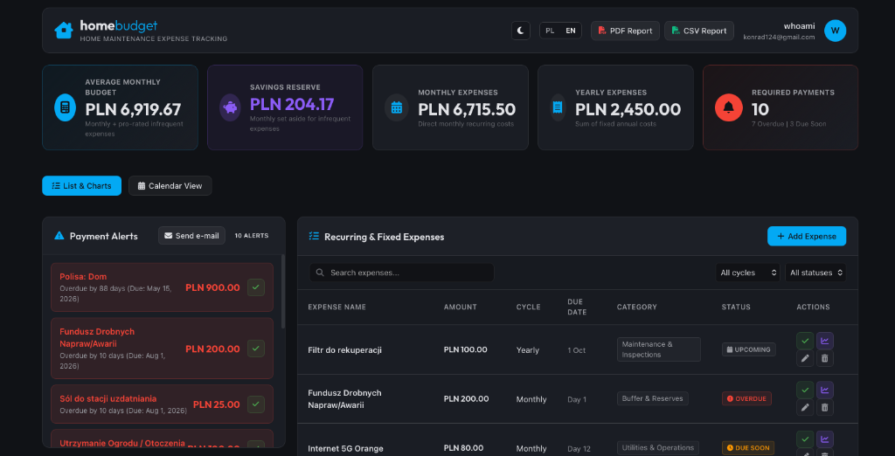
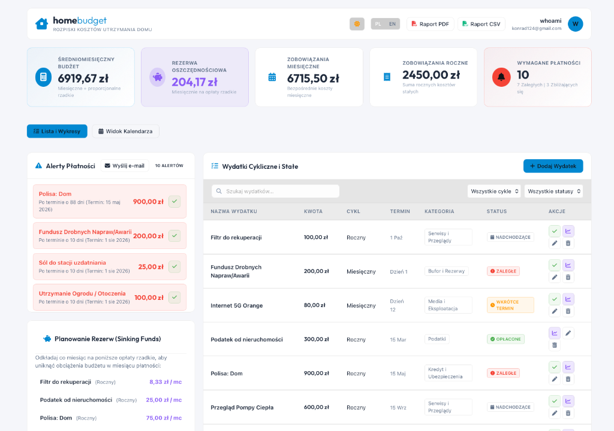

# HomeBudget 💰

[](https://github.com/zzzaspany/homebudget-python/actions)
[](LICENSE)

HomeBudget is a lightweight, high-performance, and responsive Python web application built using **FastAPI** to track and manage household expenses, sinking funds, and monthly category budgets. It integrates with a **PocketBase** backend for persistent relational data storage and uses reverse-proxy header authentication (Authelia/SSO).

---

## 📸 Interface Preview

### Slate Dark Theme (English)


### Slate Light Theme (Polish)


---

## 🚀 Key Features

*   **FastAPI Asynchronous Engine:** Low overhead, asynchronous web server serving dynamic templates and APIs.
*   **Dual-Language Support (PL / EN):** Toggled in-page via client-side controls. Includes localization of numbers, dates, cycles, payment logs, and data exports.
*   **Slate Dark & Light Themes:** Toggle seamlessly between a low-fatigue slate dark mode and a clean slate light mode. Built-in Chart.js automatic color recalibration maintains chart readability.
*   **Interactive Category Budgets:** Track spent progress against user-adjustable budget thresholds stored locally. Bars highlight in green or show a pulsing warning red if you are over budget.
*   **Analytics Charts:** Category allocations (doughnut charts) and rolling 12-month cost timelines (bar charts) generated via Chart.js.
*   **Sinking Funds Calculator:** Highlights required monthly savings allocations for infrequent annual/quarterly bills (e.g. taxes, insurance, annual services).
*   **Report Exports:** Download customized PDF summaries and semicolon-delimited CSV logs formatted according to your selected language.
*   **SSO Reverse-Proxy Authentication:** Automatically reads user profile details from headers forwarded by Authelia, proxying securely in production.

---

## 🛠 Local Development Setup

### 1. Prerequisites
*   Python 3.9+ installed.
*   Access to a PocketBase instance.

### 2. Install Dependencies
Clone the repository and install dependencies:
```bash
git clone https://github.com/zzzaspany/homebudget-python.git
cd homebudget-python
pip3 install -r requirements.txt
```

### 3. Environment Configuration
Create a `.env` file in the root directory:
```env
POCKETBASE_URL=https://pocketbase.office.lab
POCKETBASE_COLLECTION=users
POCKETBASE_USER=your-email@example.com
POCKETBASE_PASSWORD=your-password
DEV_MODE=true
```
*Setting `DEV_MODE=true` bypasses reverse-proxy header checks and uses a mock dev user profile.*

### 4. Run the Dev Server
```bash
uvicorn main:app --host 127.0.0.1 --port 8000 --reload
```
Open [http://127.0.0.1:8000](http://127.0.0.1:8000) in your browser.

---

## 🐳 Deployment (Podman Quadlets)

In production, the application is packaged as a container image and deployed as a user-level rootless **systemd** service using **Podman Quadlets**.

*   For step-by-step instructions on local container building and systemd service generation, see [deploy_readme.md](deploy_readme.md).
*   For complete system configurations and architecture layout, visit the [Documentation Overview](docs/README.md).
