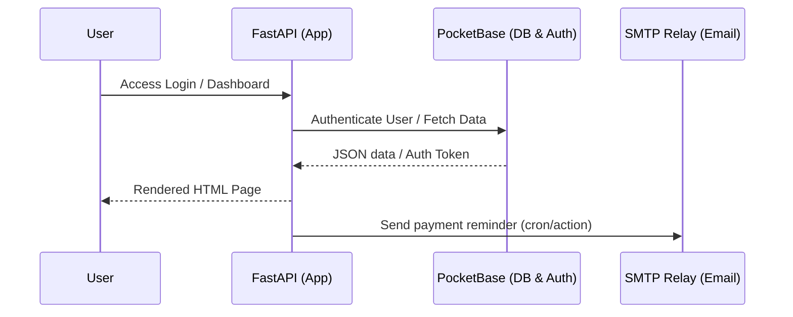

# Application Architecture & Flow 🏗️

This section outlines the backend architecture of the **HomeBudget** application, its relationship with PocketBase, and how components interact.

---

## 🛠️ System Overview

The application is structured as a **FastAPI** web application serving HTML templates dynamically (using Jinja2) and communicating with a **PocketBase** backend via REST APIs.

---

## 📦 Core Components

### 1. Web Framework (`main.py`)
*   **FastAPI**: Operates as the web framework. Handles routing, middleware, and request/response lifecycles.
*   **Jinja2 Templates**: Located under the `templates/` directory to render pages.
*   **Static Assets**: CSS and images are located under the `static/` directory.

### 2. PocketBase Client (`pb_client.py`)
*   Acts as the database client interface.
*   Handles administrative logins and collection queries (e.g., retrieving lists of payments, category budgets, and expenses).

### 3. Authentication (`auth.py`)
*   Manages user logins and secure cookie session scopes.
*   Ensures that only authorized accounts can query details or trigger modifications in the PocketBase collection.

### 4. Utilities (`utils/`)
*   **`utils/email_notifier.py`**: A utility that queries the database for upcoming unpaid bills, generates summary reminders, and connects to the central SMTP relay on port `1025` to mail notification summaries to users.
